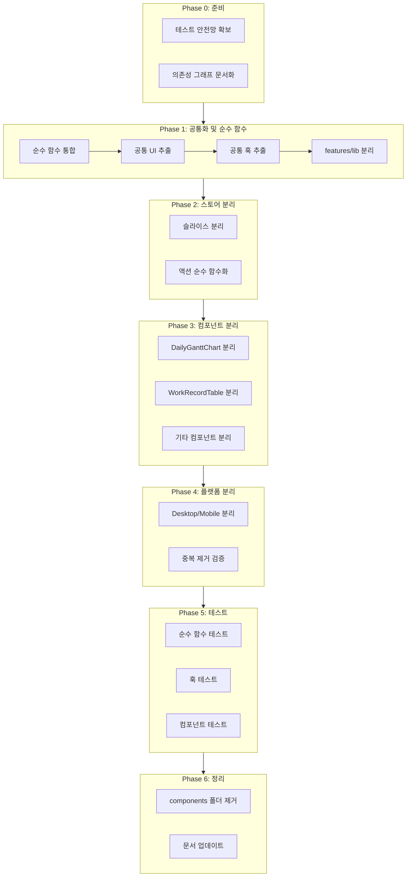

# 대규모 코드베이스 리팩토링 계획

## 현재 상태 분석

### 분리가 필요한 큰 파일들

-   `components/DailyGanttChart.tsx` (2936줄) - 분리 필수
-   `components/WorkRecordTable.tsx` (2743줄) - 분리 필수
-   `components/AdminSessionGrid.tsx` (2241줄) - 분리 필수
-   `store/useWorkStore.ts` (2062줄) - 분리 필수
-   `components/SettingsModal.tsx` (1300줄) - 분리 필수
-   `components/WorkTemplateList.tsx` (1024줄) - 분리 필수
-   `components/WeeklySchedule.tsx` (693줄) - 분리 검토
-   `components/GuideBook.tsx` (616줄) - 분리 검토

### 주요 문제점

1. **중복 코드**: `handleAddRecordOnly` 함수가 Desktop/Mobile 페이지에 복사됨
2. **순수 함수 미분리**: `timeToMinutes` 등이 컴포넌트 내부에 중복 정의
3. **스토어 과부하**: 하나의 스토어에 모든 상태와 액션이 집중
4. **features/ 미완성**: 구조만 있고 실제 마이그레이션 미완료

### 중복 코드 상세 분석 (공통화 필요)

#### 1. 순수 함수 중복 (3개 파일 이상에서 중복)

| 함수명 | 중복 위치 | shared에 존재 |

|--------|----------|--------------|

| `timeToMinutes` | DailyGanttChart, AdminSessionGrid, GanttRow | O (미사용) |

| `minutesToTime` | DailyGanttChart | O (미사용) |

| `getSessionMinutes` | DailyGanttChart, GanttBar, SessionEditTable | O (미사용) |

| `formatDuration` | 12개 파일에서 사용 | O (정상 사용) |

#### 2. 로직 중복 (수정 시 여러 곳 변경 필요)

| 로직 | 중복 위치 | 줄 수 |

|------|----------|-------|

| `handleAddRecordOnly` | DesktopDailyPage, MobileDailyPage | 각 60줄 (완전 동일) |

| deal_name 생성 로직 | DesktopDailyPage, MobileDailyPage, WorkRecordTable | 약 30줄씩 |

| AutoComplete 옵션 필터링 | DailyGanttChart, WorkRecordTable, WorkTemplateList | 약 20줄씩 |

#### 3. UI 컴포넌트 중복 (동일 패턴 반복)

| UI 패턴 | 중복 위치 | 줄 수 |

|---------|----------|-------|

| Select + dropdownRender (새 옵션 추가) | DailyGanttChart, WorkRecordTable, WorkTemplateList | 각 80-100줄 |

| 작업 폼 필드 그룹 (프로젝트 코드~비고) | DailyGanttChart, WorkRecordTable, WorkTemplateList | 각 150-200줄 |

| 완료/휴지통 모달 테이블 | WorkRecordTable 내 2개 | 각 80줄 |

| 삭제 확인 Popconfirm | 9개 파일 | 각 10-15줄 |

---

## 리팩토링 원칙 (dev-guidelines.mdc 기반)

1. **테스트 용이성**: 모든 비즈니스 로직을 순수 함수로 분리
2. **관심사 분리**: 300줄 초과 시 검토, 500줄 초과 시 필수 분리
3. **모바일/데스크탑 완전 분리**: 플랫폼별 독립 컴포넌트 트리
4. **공통화 (DRY)**: 중복 로직/UI 추출

---

## Phase 0: 준비 작업

### 0-1. 테스트 안전망 확보

-   기존 테스트 모두 통과 확인
-   핵심 기능에 대한 스모크 테스트 추가 (필요시)

### 0-2. 의존성 그래프 문서화

-   각 컴포넌트 간 import 관계 파악
-   순환 의존성 확인 및 해결 계획 수립

---

## Phase 1: 순수 함수 추출 및 통합

### 1-1. shared/lib/ 순수 함수 통합

현재 컴포넌트 내부에 중복 정의된 함수들을 `shared/lib/`로 통합:

```
shared/lib/
├── time/
│   ├── calculators.ts    # timeToMinutes, minutesToTime (이미 있음 - 통합)
│   ├── formatters.ts     # formatDuration, formatTimer (이미 있음)
│   └── validators.ts     # isValidTimeFormat (이미 있음)
├── lunch/
│   └── lunch_calculator.ts  # calculateDurationExcludingLunch (이미 있음)
├── session/
│   └── session_utils.ts     # getSessionMinutes (이미 있음)
└── record/
    └── deal_name_generator.ts  # NEW: 중복된 deal_name 생성 로직 추출
```

**작업 내용**:

-   `DailyGanttChart.tsx` 내부의 `timeToMinutes`, `minutesToTime` → `shared/lib/time` 사용
-   `useWorkStore.ts` 내부의 `calculateDurationExcludingLunch` → `shared/lib/lunch` 사용
-   Desktop/MobileDailyPage의 `handleAddRecordOnly` 로직 → `shared/lib/record/deal_name_generator.ts` 추출

### 1-2. 공통 UI 컴포넌트 추출 (DRY)

**현재 3개 파일에서 반복되는 동일 패턴을 shared/ui/로 추출**:

```
shared/ui/
├── form/
│   ├── index.ts
│   ├── WorkFormFields.tsx          # NEW: 작업 폼 필드 그룹
│   │   - 프로젝트 코드 AutoComplete
│   │   - 작업명 AutoComplete
│   │   - 거래명 AutoComplete
│   │   - 업무명/카테고리 Select
│   │   - 비고 TextArea
│   │
│   ├── SelectWithAdd.tsx           # NEW: 새 옵션 추가 가능한 Select
│   │   - dropdownRender로 "새 항목 추가" 기능 포함
│   │   - optionRender로 "숨기기(X)" 버튼 포함
│   │   - 업무명/카테고리 Select에서 공통 사용
│   │
│   └── AutoCompleteWithHide.tsx    # NEW: 숨기기 기능 있는 AutoComplete
│       - optionRender로 "숨기기(X)" 버튼 포함
│
├── modal/
│   ├── index.ts
│   ├── RecordListModal.tsx         # NEW: 레코드 목록 모달 (완료/휴지통 공통)
│   │   - 검색 Input
│   │   - 테이블 (거래명, 작업명, 시간, 날짜, 액션)
│   │   - 빈 상태 표시
│   │
│   └── ConfirmModal.tsx            # NEW: 확인 모달 래퍼 (선택적)
│
└── (기존)
    ├── TimeInput.tsx
    ├── DateInput.tsx
    ├── CategoryTag.tsx
    ├── DurationDisplay.tsx
    └── TimerDisplay.tsx
```

**추출 예시 - SelectWithAdd.tsx**:

```typescript
// shared/ui/form/SelectWithAdd.tsx
interface SelectWithAddProps {
    options: { value: string; label: string }[];
    placeholder: string;
    value?: string;
    onChange?: (value: string) => void;
    onAddOption: (newOption: string) => void;
    onHideOption?: (optionValue: string) => void;
    addPlaceholder?: string; // "새 업무명", "새 카테고리"
}

export function SelectWithAdd({
    options,
    placeholder,
    onAddOption,
    onHideOption,
    addPlaceholder = "새 항목",
    ...props
}: SelectWithAddProps) {
    const [newInput, setNewInput] = useState("");
    const inputRef = useRef<InputRef>(null);

    return (
        <Select
            {...props}
            options={options}
            placeholder={placeholder}
            optionRender={(option) => (
                <div
                    style={{ display: "flex", justifyContent: "space-between" }}
                >
                    <span>{option.label}</span>
                    {onHideOption && (
                        <CloseOutlined
                            onClick={(e) => {
                                e.stopPropagation();
                                onHideOption(option.value as string);
                            }}
                        />
                    )}
                </div>
            )}
            dropdownRender={(menu) => (
                <>
                    {menu}
                    <Divider style={{ margin: "8px 0" }} />
                    <Space style={{ padding: "0 8px 4px" }}>
                        <Input
                            ref={inputRef}
                            placeholder={addPlaceholder}
                            value={newInput}
                            onChange={(e) => setNewInput(e.target.value)}
                            size="small"
                        />
                        <Button
                            type="text"
                            icon={<PlusOutlined />}
                            onClick={() => {
                                if (newInput.trim()) {
                                    onAddOption(newInput.trim());
                                    setNewInput("");
                                }
                            }}
                            size="small"
                        >
                            추가
                        </Button>
                    </Space>
                </>
            )}
        />
    );
}
```

**사용 예시 (변경 전 → 변경 후)**:

```typescript
// 변경 전: DailyGanttChart.tsx (80줄)
<Select
  placeholder="카테고리"
  options={category_options}
  optionRender={(option) => (
    <div style={{ display: "flex", justifyContent: "space-between", alignItems: "center" }}>
      <span>{option.label}</span>
      <CloseOutlined style={{ fontSize: 10, color: "#999", cursor: "pointer" }}
        onClick={(e) => {
          e.stopPropagation();
          hideAutoCompleteOption("category_option", option.value as string);
        }}
      />
    </div>
  )}
  dropdownRender={(menu) => (
    <>
      {menu}
      <Divider style={{ margin: "8px 0" }} />
      <Space style={{ padding: "0 8px 4px", width: "100%" }} ... >
        <Input ref={new_category_input_ref} placeholder="새 카테고리" ... />
        <Button type="text" icon={<PlusOutlined />} onClick={handleAddCategoryOption} ... >
          추가
        </Button>
      </Space>
    </>
  )}
/>

// 변경 후: 1줄
<SelectWithAdd
  options={category_options}
  placeholder="카테고리"
  onAddOption={addCustomCategoryOption}
  onHideOption={(v) => hideAutoCompleteOption("category_option", v)}
  addPlaceholder="새 카테고리"
/>
```

### 1-3. 공통 훅 추출

**중복 로직을 훅으로 추출**:

```
shared/hooks/
├── index.ts
├── useResponsive.ts              # 이미 있음
├── useAutoCompleteOptions.ts     # NEW: 자동완성 옵션 관리
│   - 프로젝트 코드, 작업명, 거래명 옵션 생성
│   - 필터링 로직 포함
│
└── useRecordCreation.ts          # NEW: 레코드 생성 로직
    - deal_name 생성 (중복 시 넘버링)
    - 템플릿 → 레코드 변환
    - handleAddRecordOnly 로직 통합
```

**useRecordCreation.ts 예시**:

```typescript
// shared/hooks/useRecordCreation.ts
export function useRecordCreation() {
    const addRecord = useWorkStore((s) => s.addRecord);
    const records = useWorkStore((s) => s.records);
    const selected_date = useWorkStore((s) => s.selected_date);
    const use_postfix = useWorkStore((s) => s.use_postfix_on_preset_add);

    /**
     * 템플릿에서 레코드 생성 (Desktop/Mobile 공통)
     * - 기존 DesktopDailyPage, MobileDailyPage의 handleAddRecordOnly 통합
     */
    const createRecordFromTemplate = useCallback(
        (template_id: string) => {
            const template = useWorkStore
                .getState()
                .templates.find((t) => t.id === template_id);
            if (!template) return;

            const deal_name = generateDealName(template, records, use_postfix);
            const new_record = createNewRecord(
                template,
                deal_name,
                selected_date
            );

            addRecord(new_record);
            message.success(`"${template.work_name}" 작업이 추가되었습니다`);
        },
        [addRecord, records, selected_date, use_postfix]
    );

    return { createRecordFromTemplate };
}

// 사용 (Desktop/Mobile 공통)
const { createRecordFromTemplate } = useRecordCreation();
// ... on_add_record_only={createRecordFromTemplate}
```

### 1-4. features//lib/ 비즈니스 로직 분리

각 feature의 핵심 로직을 순수 함수로 분리:

```
features/
├── gantt-chart/lib/
│   ├── slot_calculator.ts      # 이미 있음
│   ├── drag_handler.ts         # 이미 있음, 확장 필요
│   ├── resize_handler.ts       # NEW: 리사이즈 로직 추출
│   └── conflict_detector.ts    # NEW: 충돌 감지 로직 추출
│
├── work-record/lib/
│   ├── record_merger.ts        # 이미 있음
│   ├── conflict_detector.ts    # 이미 있음
│   ├── duration_calculator.ts  # 이미 있음
│   ├── record_filter.ts        # NEW: 레코드 필터링 로직
│   └── record_sorter.ts        # NEW: 정렬 로직
│
├── weekly-schedule/lib/
│   ├── copy_formatter.ts       # 이미 있음
│   ├── day_grouper.ts          # NEW: 요일별 그룹화 로직
│   └── summary_calculator.ts   # NEW: 통계 계산 로직
│
└── admin/lib/
    ├── problem_detector.ts     # 이미 있음
    ├── conflict_finder.ts      # 이미 있음
    └── stats_calculator.ts     # NEW: 통계 계산 로직
```

---

## Phase 2: 스토어 분리

### 2-1. useWorkStore.ts 슬라이스 분리

현재 2062줄의 거대한 스토어를 기능별 슬라이스로 분리:

```
store/
├── slices/
│   ├── records.ts       # WorkRecord 관련 상태 및 액션
│   ├── templates.ts     # WorkTemplate 관련 상태 및 액션
│   ├── timer.ts         # Timer 관련 상태 및 액션
│   ├── settings.ts      # 설정 관련 상태 (테마, 점심시간 등)
│   └── form.ts          # 폼 데이터 관련 상태
├── useWorkStore.ts      # 슬라이스 조합 (200줄 이내)
└── index.ts
```

**분리 기준**:

-   `records.ts`: addRecord, updateRecord, deleteRecord, restoreRecord 등
-   `templates.ts`: addTemplate, updateTemplate, deleteTemplate, reorderTemplates 등
-   `timer.ts`: startTimer, stopTimer, pauseTimer 등
-   `settings.ts`: 테마, 점심시간, 자동완성 옵션 등
-   `form.ts`: form_data, setFormField 등

### 2-2. 액션 함수 순수 함수화

스토어 내부 로직을 순수 함수로 추출하여 테스트 가능하게 만들기:

```typescript
// 현재 (테스트 어려움)
const useWorkStore = create((set, get) => ({
  addRecord: (record) => {
    // 복잡한 로직이 스토어 내부에...
  }
}));

// 변경 후 (테스트 용이)
// lib/record/add_record.ts (순수 함수)
export function createNewRecord(template, options) { ... }

// store/slices/records.ts
const useRecordsSlice = create((set) => ({
  addRecord: (template, options) => {
    const new_record = createNewRecord(template, options);
    set((state) => ({ records: [...state.records, new_record] }));
  }
}));
```

---

## Phase 3: 컴포넌트 분리

### 3-1. DailyGanttChart.tsx 분리 (2936줄 → 각 150~300줄)

```
features/gantt-chart/
├── ui/
│   ├── GanttChart/
│   │   ├── index.ts
│   │   ├── GanttChart.tsx           # 메인 컨테이너 (300줄 이내)
│   │   ├── GanttHeader.tsx          # 헤더 (날짜 네비게이션)
│   │   ├── GanttTimeAxis.tsx        # 시간축 (이미 TimeAxis.tsx 있음)
│   │   ├── GanttRow.tsx             # 행 컴포넌트 (이미 있음)
│   │   ├── GanttBar.tsx             # 바 컴포넌트 (이미 있음)
│   │   └── LunchOverlay.tsx         # 점심시간 오버레이 (이미 있음)
│   │
│   ├── GanttAddForm/
│   │   ├── index.ts
│   │   ├── AddFormModal.tsx         # 작업 추가 모달
│   │   └── QuickAddPopover.tsx      # 빠른 추가 팝오버
│   │
│   └── GanttContextMenu/
│       ├── index.ts
│       └── SessionContextMenu.tsx   # 우클릭 메뉴
│
├── hooks/
│   ├── useGanttDrag.ts              # 드래그 관련 훅
│   ├── useGanttResize.ts            # 리사이즈 관련 훅
│   └── useGanttSelection.ts         # 선택 관련 훅
│
└── lib/
    ├── slot_calculator.ts           # 이미 있음
    └── ...
```

### 3-2. WorkRecordTable.tsx 분리 (2743줄 → 각 150~300줄)

```
features/work-record/
├── ui/
│   ├── RecordTable/
│   │   ├── index.ts
│   │   ├── RecordTable.tsx          # 메인 테이블 컨테이너
│   │   ├── RecordTableHeader.tsx    # 이미 있음
│   │   ├── RecordActions.tsx        # 이미 있음
│   │   └── RecordRow.tsx            # 행 렌더링
│   │
│   ├── RecordForm/
│   │   ├── index.ts
│   │   ├── RecordEditModal.tsx      # 수정 모달
│   │   └── RecordFormFields.tsx     # 폼 필드들
│   │
│   ├── RecordStats/
│   │   ├── index.ts
│   │   └── DailyStats.tsx           # 일간 통계
│   │
│   ├── MobileRecordCard/            # 이미 있음
│   │   └── ...
│   │
│   └── CompletedRecords/            # 이미 있음
│       └── ...
│
├── hooks/
│   ├── useRecordFilter.ts           # 필터링 훅
│   ├── useRecordSelection.ts        # 선택 관련 훅
│   └── useRecordTimer.ts            # 타이머 표시 훅
│
└── lib/
    └── ...
```

### 3-3. AdminSessionGrid.tsx 분리 (2241줄 → 각 200~300줄)

```
features/admin/
├── ui/
│   ├── AdminDashboard/
│   │   ├── index.ts
│   │   ├── AdminDashboard.tsx       # 메인 대시보드
│   │   └── StatsOverview.tsx        # 이미 있음
│   │
│   ├── SessionsTab/
│   │   ├── index.ts
│   │   ├── SessionsTab.tsx          # 세션 탭 컨테이너
│   │   ├── ConflictsView.tsx        # 이미 있음
│   │   └── ProblemsList.tsx         # 이미 있음
│   │
│   └── RecordsTab/
│       ├── index.ts
│       ├── RecordsTab.tsx           # 레코드 탭 컨테이너
│       └── DuplicatesView.tsx       # 이미 있음
│
└── lib/
    └── ...
```

### 3-4. SettingsModal.tsx 분리 (1300줄 → 각 150~250줄)

```
features/settings/
├── ui/
│   ├── SettingsModal.tsx            # 모달 컨테이너 (200줄 이내)
│   └── tabs/
│       ├── index.ts
│       ├── DataTab.tsx              # 이미 있음
│       ├── ThemeTab.tsx             # 이미 있음
│       ├── ShortcutsTab.tsx         # 이미 있음
│       └── AutoCompleteTab.tsx      # 이미 있음
│
└── hooks/
    └── useSettingsForm.ts           # 설정 폼 관련 훅
```

### 3-5. WorkTemplateList.tsx 분리 (1024줄 → 각 150~250줄)

```
features/work-template/
├── ui/
│   ├── TemplateList/
│   │   ├── index.ts
│   │   ├── TemplateList.tsx         # 메인 리스트 컨테이너
│   │   ├── TemplateCard.tsx         # 이미 있음
│   │   └── TemplateDndList.tsx      # DnD 리스트
│   │
│   ├── TemplateForm/
│   │   ├── index.ts
│   │   ├── TemplateFormModal.tsx    # 템플릿 추가/수정 모달
│   │   └── ColorPicker.tsx          # 이미 있음
│   │
│   └── TemplateActions/
│       └── TemplateContextMenu.tsx  # 템플릿 컨텍스트 메뉴
│
└── hooks/
    └── useTemplateDnd.ts            # DnD 관련 훅
```

### 3-6. WeeklySchedule.tsx 분리 (693줄 → 각 150~250줄)

```
features/weekly-schedule/
├── ui/
│   ├── WeeklySchedule/
│   │   ├── index.ts
│   │   ├── WeeklySchedule.tsx       # 메인 컨테이너
│   │   ├── WeekHeader.tsx           # 주간 헤더 (네비게이션)
│   │   ├── DayColumn.tsx            # 이미 있음
│   │   └── WeeklySummary.tsx        # 주간 요약
│   │
│   └── CopyFormat/
│       ├── index.ts
│       └── CopyFormatSelector.tsx   # 이미 있음
│
└── lib/
    └── copy_formatter.ts            # 이미 있음
```

---

## Phase 4: 모바일/데스크탑 완전 분리

### 4-1. 컴포넌트별 플랫폼 분리

현재 `useResponsive` 조건문으로 분기하는 컴포넌트들을 완전 분리:

```
features/gantt-chart/ui/
├── DesktopGanttChart.tsx
└── MobileGanttChart.tsx

features/work-record/ui/
├── DesktopRecordTable.tsx
└── MobileRecordList.tsx  (카드 형태)
```

### 4-2. 공통 로직 훅으로 추출

플랫폼 공유 로직은 훅으로 추출:

```typescript
// features/work-record/hooks/useRecordOperations.ts
export function useRecordOperations() {
  const addRecord = useCallback(...);
  const updateRecord = useCallback(...);
  return { addRecord, updateRecord };
}

// DesktopRecordTable.tsx
const { addRecord } = useRecordOperations();

// MobileRecordList.tsx
const { addRecord } = useRecordOperations();
```

---

## Phase 5: 테스트 보강

### 5-1. 순수 함수 테스트 추가

새로 추출한 모든 lib/ 함수에 대해 유닛 테스트 작성:

```
test/unit/
├── shared/lib/
│   └── record/
│       └── deal_name_generator.test.ts
│
└── features/
    ├── gantt-chart/lib/
    │   ├── resize_handler.test.ts
    │   └── conflict_detector.test.ts
    │
    └── weekly-schedule/lib/
        ├── day_grouper.test.ts
        └── summary_calculator.test.ts
```

### 5-2. 훅 테스트 추가

새로 추출한 훅에 대해 테스트 작성:

```
test/hooks/
├── useGanttDrag.test.ts
├── useGanttResize.test.ts
└── useRecordOperations.test.ts
```

### 5-3. 컴포넌트 테스트 업데이트

분리된 컴포넌트에 맞게 테스트 구조 재편:

```
test/component/features/
├── gantt-chart/
│   ├── GanttChart.test.tsx
│   ├── GanttBar.test.tsx
│   └── AddFormModal.test.tsx
│
└── work-record/
    ├── RecordTable.test.tsx
    └── RecordEditModal.test.tsx
```

---

## Phase 6: 정리 및 마이그레이션 완료

### 6-1. components/ 폴더 제거

모든 컴포넌트가 features/로 마이그레이션된 후:

-   `components/` 폴더의 기존 파일들 삭제
-   import 경로 업데이트

### 6-2. 기존 테스트 마이그레이션

`test/components/` 테스트들을 `test/component/features/`로 이동

### 6-3. 문서 업데이트

-   `project-overview.mdc` 업데이트
-   README.md 업데이트

---

## 실행 순서 및 우선순위



### 권장 작업 순서

**우선순위: 공통화를 먼저 해야 컴포넌트 분리 시 중복이 줄어듦**

1. **Phase 1-1**: shared/lib 순수 함수 통합

-   `timeToMinutes`, `minutesToTime` → shared/lib/time 사용하도록 변경 - `getSessionMinutes` → shared/lib/session 사용하도록 변경 - 약 6개 파일에서 직접 정의된 함수 제거

1. **Phase 1-2**: 공통 UI 컴포넌트 추출 (가장 효과적)

-   `SelectWithAdd.tsx` 생성 → 3개 파일에서 각 80줄씩 240줄 절감 - `WorkFormFields.tsx` 생성 → 3개 파일에서 각 150줄씩 450줄 절감 - **총 약 700줄 이상 중복 제거**

1. **Phase 1-3**: 공통 훅 추출

-   `useRecordCreation.ts` → Desktop/MobileDailyPage 120줄 → 각 5줄 - `useAutoCompleteOptions.ts` → 옵션 생성 로직 통합

1. **Phase 2-1**: useWorkStore 슬라이스 분리

-   2062줄 → 각 300-400줄 슬라이스로 분리

1. **Phase 3-1, 3-2**: 거대 컴포넌트 분리

-   공통 UI가 이미 추출되어 있으므로 분리 작업이 쉬워짐 - DailyGanttChart: 2936줄 → (공통화 후) 약 2200줄 → 분리 후 각 200-300줄 - WorkRecordTable: 2743줄 → (공통화 후) 약 2000줄 → 분리 후 각 200-300줄

1. **Phase 3-3~3-6**: 나머지 컴포넌트 분리
2. **Phase 4**: 플랫폼 분리 (공통 훅 덕분에 중복 없음)
3. **Phase 5, 6**: 테스트 및 정리

### 공통화 효과 예측

| 항목 | 현재 중복 | 공통화 후 |

|------|----------|----------|

| SelectWithAdd 패턴 | 3개 파일 × 80줄 = 240줄 | 1개 파일 80줄 |

| WorkFormFields 패턴 | 3개 파일 × 150줄 = 450줄 | 1개 파일 150줄 |

| handleAddRecordOnly | 2개 파일 × 60줄 = 120줄 | 1개 훅 30줄 |

| 순수 함수 중복 | 6개 파일 × 20줄 = 120줄 | 0줄 (shared 사용) |

| **총 절감** | **약 930줄** | **약 260줄** |

**670줄 이상 중복 코드 제거 + 유지보수 포인트 단일화**

---

## 주의사항

1. **점진적 마이그레이션**: 한 번에 모든 것을 바꾸지 않고, 기능별로 점진적으로 진행
2. **테스트 유지**: 각 단계마다 기존 테스트 통과 확인
3. **기능 동일성**: UI와 기능이 변경되지 않도록 주의
4. **롤백 가능**: 각 단계별 커밋으로 롤백 가능하게 유지
5. **의존성 방향**: pages -> widgets -> features -> shared 방향 준수
6. **공통화 우선**: 컴포넌트 분리 전에 공통 UI/훅을 먼저 추출 (분리 작업이 쉬워짐)
7. **2회 이상 중복 = 공통화**: 같은 코드가 2회 이상 나타나면 반드시 추출
8. **수정 포인트 단일화**: 기능 수정 시 한 곳만 고치면 되도록 구조화

---

## 예상 파일 구조 (최종)

```
src/
├── app/                         # 앱 진입점
├── pages/                       # 페이지
├── widgets/                     # 위젯
├── features/                    # 기능 모듈 (핵심)
│   ├── gantt-chart/
│   ├── work-record/
│   ├── work-template/
│   ├── weekly-schedule/
│   ├── settings/
│   ├── admin/
│   ├── timer/
│   └── sync/
├── shared/                      # 공유 리소스
│   ├── lib/
│   ├── types/
│   ├── config/
│   ├── ui/
│   └── hooks/
├── store/                       # 상태 관리
│   ├── slices/
│   └── useWorkStore.ts
├── firebase/                    # Firebase 연동
└── test/                        # 테스트
```
