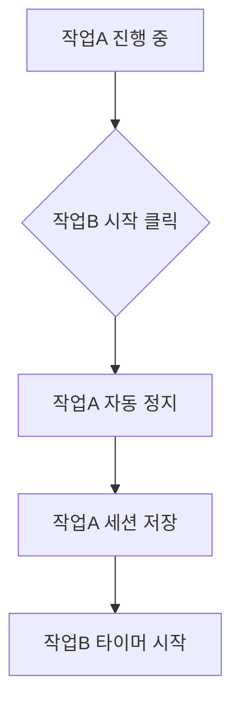

# 일간 기록

일간 기록 페이지는 앱의 **메인 화면**으로, 하루 동안의 작업을 기록하고 관리해요. 타이머로 정확한 시간을 측정하고, 간트차트로 시각적으로 확인할 수 있어요.

---

## 작업 기록 테이블

아래는 실제 작업 기록 테이블의 모습이에요:

:::demo WorkRecordTable:::

### 테이블 컬럼 구성

| 컬럼          | 설명                                            | 상호작용             |
| ------------- | ----------------------------------------------- | -------------------- |
| **(타이머)**  | 시작/정지 토글 아이콘                           | 클릭하여 타이머 토글 |
| **거래명**    | 거래명 또는 작업명, 진행 중일 때 경과 시간 표시 | -                    |
| **작업명**    | 프로젝트/업무명                                 | -                    |
| **업무명**    | 업무 유형                                       | -                    |
| **카테고리**  | 작업 분류                                       | -                    |
| **시간**      | 해당 날짜의 총 소요 시간                        | -                    |
| **시작-종료** | 시작~종료 시간                                  | -                    |
| **날짜**      | 기록 날짜                                       | -                    |
| **(작업)**    | 완료, 수정, 삭제 버튼                           | 클릭하여 동작 실행   |

### 헤더 영역

테이블 상단에는 날짜 탐색, 캘린더 스트립, 작업 추가 등의 기능이 있어요.

| 요소                   | 설명                                                     |
| ---------------------- | -------------------------------------------------------- |
| **날짜 탐색**          | 좌/우 화살표 + "M월 D일 X요일" + 달력 선택 + "오늘" 뱃지 |
| **주간 캘린더 스트립** | 월~일 7일 스트립 (선택일, 오늘, 기록 있는 날 표시)       |
| **"주간" 토글**        | 캘린더 스트립 표시/숨기기                                |
| **"새 작업" 버튼**     | Primary 버튼 + 단축키 뱃지 (단축키: `Alt + N`)           |
| **더보기 메뉴 (...)**  | 완료, 휴지통, 내역 복사                                  |

### 날짜 선택

| 요소        | 기능               | 단축키    |
| ----------- | ------------------ | --------- |
| 달력 날짜   | 달력에서 날짜 선택 | -         |
| 좌측 화살표 | 이전 날짜로 이동   | `Alt + ←` |
| 우측 화살표 | 다음 날짜로 이동   | `Alt + →` |
| "오늘" 뱃지 | 오늘 날짜로 이동   | `Alt + T` |

> 날짜 관련 [단축키](wiki:shortcuts)를 사용하면 더 빠르게 탐색할 수 있어요.

### 주간 캘린더 스트립

"주간" 토글을 켜면 현재 주의 월~일 7일이 스트립으로 표시돼요.

| 표시             | 설명                     |
| ---------------- | ------------------------ |
| **선택일**       | 테마색 배경으로 강조     |
| **오늘**         | 날짜 아래 작은 테마색 점 |
| **기록 있는 날** | 날짜 아래 작은 회색 점   |

### 테이블 푸터

테이블 하단에 "총 N건" 텍스트와 함께 다음 버튼이 표시돼요:

| 버튼          | 설명                             |
| ------------- | -------------------------------- |
| **완료 목록** | 완료된 작업 모달 열기            |
| **휴지통**    | 삭제된 작업 모달 열기            |
| **내역 복사** | 당일 작업 내역을 클립보드에 복사 |

### 행 액션 버튼

각 작업 행의 우측에 액션 버튼이 있어요:

| 버튼          | 아이콘               | 설명                     |
| ------------- | -------------------- | ------------------------ |
| **완료**      | 체크 아이콘 (녹색)   | 미완료 작업에 표시       |
| **완료 취소** | 되돌리기 아이콘      | 완료된 작업에 표시       |
| **수정**      | 편집 아이콘          | 작업 정보 수정 모달 열기 |
| **삭제**      | 삭제 아이콘 (빨간색) | 확인 후 휴지통으로 이동  |

> **참고**: 타이머가 진행 중인 행에서는 완료와 삭제 버튼이 숨겨져요.

---

## 타이머 사용법

### 타이머 시작 방법

| 방법                                | 설명                                | 적합한 상황               |
| ----------------------------------- | ----------------------------------- | ------------------------- |
| **테이블 타이머 아이콘**            | 기존 작업의 시작 아이콘 클릭        | 이미 등록된 작업 이어하기 |
| **[프리셋](wiki:work-preset) 추가** | 사이드바에서 프리셋의 + 버튼 클릭   | 새 작업 빠르게 추가       |
| **새 작업 추가**                    | 작업 추가 후 테이블에서 타이머 시작 | 새 작업 등록하면서 시작   |

### 타이머 동작 흐름

1. **시작**: 현재 시각이 세션 시작 시간으로 기록돼요
2. **진행**: 초 단위로 경과 시간이 거래명 옆에 표시돼요
3. **정지**: 현재 시각이 세션 종료 시간으로 기록되고, 세션이 작업에 추가돼요

### 작업 전환

다른 작업을 시작하면 **자동으로 현재 작업이 정지**돼요:

> **데이터 손실 없음**: 작업 전환 시 이전 작업의 시간은 항상 저장돼요.

---

## 새 작업 추가

### 추가 방법

1. 테이블 헤더의 **"새 작업"** 버튼 클릭 (단축키: `Alt + N`)
2. 모달에서 작업 정보 입력
3. **"추가 (F8)"** 버튼 클릭

### 입력 필드

| 필드                   | 설명                                     | 필수 | 자동완성 |
| ---------------------- | ---------------------------------------- | :--: | :------: |
| **프로젝트 코드**      | 프로젝트 식별 코드 (미입력 시 A00_00000) |  -   |    O     |
| **작업명**             | 프로젝트/업무명                          |  O   |    O     |
| **거래명 (상세 작업)** | 작업의 상세 제목                         |  -   |    O     |
| **업무명**             | 업무 유형 선택                           |  -   |    O     |
| **카테고리**           | 작업 분류 선택                           |  -   |    O     |
| **비고**               | 추가 메모                                |  -   |    -     |

### 자동완성 기능

이전에 입력한 값들이 자동완성으로 제안돼요.

| 기능           | 설명                                                     |
| -------------- | -------------------------------------------------------- |
| **부분 검색**  | 입력한 글자가 포함된 모든 옵션이 표시돼요                |
| **하이라이트** | 검색어와 일치하는 부분이 강조돼요                        |
| **옵션 숨김**  | 불필요한 옵션은 [설정](wiki:settings)에서 숨길 수 있어요 |

---

## 작업 수정 및 삭제

### 수정하기

1. 작업 행의 **편집 아이콘** 클릭
2. 모달에서 정보 수정
3. **"저장 (F8)"** 버튼 클릭

> **진행 중인 작업 수정**: 타이머가 실행 중이어도 작업 정보는 수정할 수 있어요.

### 삭제하기

1. 작업 행의 **삭제 아이콘** 클릭
2. 확인 팝업에서 **"삭제"** 클릭
3. 작업이 휴지통으로 이동

### 휴지통

| 동작          | 설명                      |
| ------------- | ------------------------- |
| **복원**      | 작업을 다시 테이블로 복원 |
| **영구 삭제** | 완전히 삭제 (복구 불가)   |

> 휴지통은 테이블 푸터의 "휴지통" 버튼 또는 더보기 메뉴에서 열 수 있어요.

---

## 세션 관리

### 세션 펼쳐 보기

작업 행 좌측의 **펼침 아이콘**을 클릭하면 "세션 이력 (N개)" 목록이 펼쳐져요.

### 세션 편집 테이블

각 세션에 대해 다음 정보가 표시돼요:

| 항목          | 설명                                    |    수정 가능     |
| ------------- | --------------------------------------- | :--------------: |
| **번호**      | 세션 순번 (1, 2, 3...)                  |        -         |
| **날짜**      | 세션 날짜                               |        O         |
| **시작 시간** | HH:mm 형식                              |        O         |
| **종료 시간** | HH:mm 형식 (진행 중이면 "진행 중" 표시) | O (진행 중 제외) |
| **소요 시간** | 자동 계산                               |        -         |
| **삭제**      | 세션 삭제 (확인 후)                     | O (진행 중 제외) |

### 세션 요약

세션 목록 하단에 요약 정보가 표시돼요:

-   **첫 시작**: 가장 이른 시작 시간
-   **마지막 종료**: 가장 늦은 종료 시간
-   **총**: 전체 소요 시간 합계

> **진행 중인 세션**: 종료 시간은 수정할 수 없어요. 타이머를 정지한 후에 수정하세요.

---

## 작업 완료

### 완료 표시

작업 행의 **완료** 버튼을 클릭하면 작업이 완료 처리돼요.

| 동작                 | 설명                                                     |
| -------------------- | -------------------------------------------------------- |
| **타이머 자동 중지** | 진행 중인 작업을 완료하면 타이머가 자동으로 멈춰요       |
| **완료 해제**        | 완료된 작업의 타이머를 시작하면 자동으로 완료가 해제돼요 |

> **팁**: 작업을 끝내고 완료 버튼을 누르면 별도로 타이머를 멈출 필요가 없어요.

### 완료된 작업 모달

테이블 푸터의 **"완료 목록"** 버튼을 클릭하면 완료 처리된 작업 목록을 볼 수 있어요.

| 컬럼          | 설명                                  |
| ------------- | ------------------------------------- |
| **작업명**    | 프로젝트/업무명                       |
| **거래명**    | 작업의 상세 제목                      |
| **카테고리**  | 작업 분류 태그                        |
| **소요 시간** | 총 작업 시간                          |
| **완료일**    | 완료 처리한 날짜                      |
| **복원**      | 완료를 취소하고 다시 진행 중으로 변경 |

빈 상태: "완료된 작업이 없습니다"

---

## 간트차트

아래는 실제 간트차트의 모습이에요:

:::demo DailyGanttChart:::

### 간트차트 구성

| 요소              | 설명                                                           |
| ----------------- | -------------------------------------------------------------- |
| **헤더**          | "일간 타임라인" 제목, 좌/우 화살표 날짜 탐색, 총 소요시간 뱃지 |
| **힌트**          | "빈 영역을 드래그하여 작업 추가"                               |
| **X축**           | 시간 (08:00 ~ 20:00)                                           |
| **Y축**           | 작업(거래명) 목록                                              |
| **바**            | 각 세션의 시간 범위                                            |
| **현재 시간선**   | 빨간 점 + 세로선으로 현재 시각 표시                            |
| **점심시간 영역** | 줄무늬 패턴 + 커피 아이콘 (기본 11:40~12:40)                   |

### 실시간 진행 표시

타이머가 진행 중인 작업은 테마색 그림자와 펄스 애니메이션으로 표시돼요.

### 드래그로 작업 추가

간트차트의 빈 영역을 드래그하여 새 작업을 추가할 수 있어요.

작업 추가 모달에서 두 가지 모드를 선택할 수 있어요:

| 모드                 | 설명                                         |
| -------------------- | -------------------------------------------- |
| **새 작업 추가**     | 새로운 작업을 생성하고 세션 추가             |
| **기존 작업에 추가** | 오늘 기록에 있는 작업을 선택하여 세션만 추가 |

> **팁**: 기존 작업에 추가 모드를 사용하면 같은 작업에 여러 시간대의 세션을 빠르게 추가할 수 있어요.

### 바 리사이즈

간트차트 바의 양끝을 드래그하여 세션 시간을 조정할 수 있어요.

| 상태             | 왼쪽 핸들 (시작 시간) | 오른쪽 핸들 (종료 시간) |
| ---------------- | --------------------- | ----------------------- |
| **일반 세션**    | 조절 가능             | 조절 가능               |
| **진행 중 세션** | 조절 가능 (앞당기기)  | 조절 불가 (실시간 증가) |

### 더블클릭으로 작업 수정

간트차트 바를 **더블클릭**하면 작업 수정 모달이 열려요.

| 항목             | 설명                                                                          |
| ---------------- | ----------------------------------------------------------------------------- |
| **세션 시간**    | 시작/종료 시간 수정 + 소요 시간 표시                                          |
| **작업 정보**    | 프로젝트 코드, 작업명, 거래명, 업무명, 카테고리, 비고                         |
| **저장 단축키**  | `F8`                                                                          |
| **진행 중 세션** | 시작 시간만 수정 가능, "진행 중인 세션은 시작 시간만 수정할 수 있습니다" 힌트 |

### 우클릭 메뉴

간트차트 바를 **우클릭**하면 메뉴가 나타나요.

| 메뉴 항목     | 설명                                    |
| ------------- | --------------------------------------- |
| **작업 수정** | 더블클릭과 동일하게 작업 수정 모달 열기 |
| **세션 삭제** | 해당 세션만 삭제 (확인 후 삭제)         |

### 0분 세션 표시

0분 또는 1분 이하의 짧은 세션도 간트차트에 표시돼요.

| 표시                | 설명                                                  |
| ------------------- | ----------------------------------------------------- |
| **최소 너비**       | 모든 세션이 최소 5분 너비로 표시돼요                  |
| **경고 표시**       | 0분 세션은 점선 테두리와 경고 아이콘으로 표시돼요     |
| **펄스 애니메이션** | 0분 세션은 깜빡이는 애니메이션으로 눈에 띄게 표시돼요 |

### 시간 충돌 표시

서로 다른 작업의 시간대가 겹치면 **충돌**로 표시되어 조정이 필요함을 알려줘요.

| 표시                   | 설명                                                        |
| ---------------------- | ----------------------------------------------------------- |
| **빨간색 테두리**      | 충돌이 있는 세션이 빨간색 테두리로 강조돼요                 |
| **경고 아이콘**        | 세션 바에 경고 아이콘이 표시돼요                            |
| **충돌 구간 오버레이** | 겹치는 시간 구간에 빨간색 사선 패턴이 표시돼요              |
| **툴팁 안내**          | 충돌 구간에 마우스를 올리면 조정이 필요하다는 안내가 나와요 |

> **해결 방법**: 충돌이 표시되면 바의 양끝을 드래그하여 시간을 조정하세요.

---

## 점심시간 자동 제외

점심시간은 작업 시간 계산에서 자동으로 제외돼요. 기본값은 **11:40 ~ 12:40**이에요.

| 항목              | 예시                  |
| ----------------- | --------------------- |
| 실제 타이머 시간  | 11:00 ~ 13:00 (2시간) |
| 점심시간 제외     | -1시간                |
| **기록되는 시간** | **1시간**             |

> **설정 변경**: 점심시간은 [설정](wiki:settings)의 데이터 탭에서 변경할 수 있어요.

---

## 관련 문서

-   **[시작하기](wiki:getting-started)**: 앱 전체 개요 및 화면 구성
-   **[작업 프리셋](wiki:work-preset)**: 프리셋으로 빠르게 작업 시작하기
-   **[주간 일정](wiki:weekly-schedule)**: 주간 단위 작업 조회 및 복사
-   **[단축키 목록](wiki:shortcuts)**: 키보드 단축키로 빠른 조작
