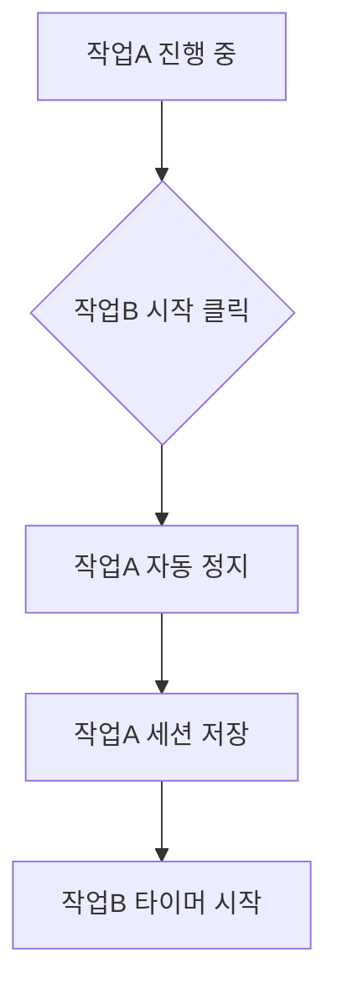

# 일간 기록

일간 기록 페이지는 앱의 **메인 화면**으로, 하루 동안의 작업을 기록하고 관리합니다. 타이머로 정확한 시간을 측정하고, 간트차트로 시각적으로 확인할 수 있습니다.

---

## 작업 기록 테이블

아래는 실제 작업 기록 테이블의 모습입니다:

:::demo WorkRecordTable:::

### 테이블 컬럼 구성

| 컬럼          | 설명                     | 상호작용                 |
| ------------- | ------------------------ | ------------------------ |
| **▶️ 타이머** | 작업 시작/정지 버튼      | 클릭하여 토글            |
| **거래명**    | 작업 상세 제목           | 진행 중일 때 타이머 표시 |
| **작업명**    | 프로젝트명 (파란색 태그) | -                        |
| **업무명**    | 업무 유형 (청록색 태그)  | -                        |
| **카테고리**  | 작업 분류                | -                        |
| **소요 시간** | 해당 날짜의 총 작업 시간 | -                        |
| **시간**      | 시작~종료 시간           | -                        |
| **액션**      | 수정, 삭제, 완료 버튼    | 클릭하여 동작 실행       |

### 날짜 선택

| 요소    | 기능               | 단축키    |
| ------- | ------------------ | --------- |
| 📅 날짜 | 달력에서 날짜 선택 | -         |
| ◀       | 이전 날짜로 이동   | `Alt + ←` |
| ▶       | 다음 날짜로 이동   | `Alt + →` |
| 오늘    | 오늘 날짜로 이동   | `Alt + T` |

> 날짜 관련 [단축키](wiki:shortcuts)를 사용하면 더 빠르게 탐색할 수 있습니다.

---

## 타이머 사용법

### 타이머 시작 방법

| 방법                                | 설명                        | 적합한 상황               |
| ----------------------------------- | --------------------------- | ------------------------- |
| **테이블 ▶️ 버튼**                  | 기존 작업의 시작 버튼 클릭  | 이미 등록된 작업 이어하기 |
| **[프리셋](wiki:work-preset) 클릭** | 사이드바에서 프리셋 선택    | 새 작업 빠르게 시작       |
| **새 작업 추가**                    | 작업 추가 후 바로 시작 옵션 | 새 작업 등록하면서 시작   |

### 타이머 동작 흐름

1. **시작**: 현재 시각이 `start_time`으로 기록됨
2. **진행**: 초 단위로 경과 시간 표시
3. **정지**: 현재 시각이 `end_time`으로 기록, 세션이 작업에 추가됨

### 작업 전환

다른 작업을 시작하면 **자동으로 현재 작업이 정지**됩니다:

> **데이터 손실 없음**: 작업 전환 시 이전 작업의 시간은 항상 저장됩니다.

---

## 새 작업 추가

### 추가 방법

1. 테이블 상단의 **"+ 새 작업"** 버튼 클릭 (단축키: `Alt + N`)
2. 모달에서 작업 정보 입력
3. **"추가"** 또는 **"추가 후 시작"** 버튼 클릭

### 입력 필드

| 필드              | 설명               | 필수 | 자동완성 |
| ----------------- | ------------------ | :--: | :------: |
| **프로젝트 코드** | 프로젝트 식별 코드 |  -   |    ✅    |
| **작업명**        | 프로젝트/업무명    |  ✅  |    ✅    |
| **업무명**        | 업무 유형 선택     |  -   |    ✅    |
| **거래명**        | 작업의 상세 제목   |  -   |    ✅    |
| **카테고리**      | 작업 분류 선택     |  -   |    ✅    |
| **비고**          | 추가 메모          |  -   |    -     |

### 자동완성 기능

이전에 입력한 값들이 자동완성으로 제안됩니다. 불필요한 옵션은 [설정](wiki:settings)에서 숨길 수 있습니다.

---

## 작업 수정 및 삭제

### 수정하기

1. 작업 행의 **✏️ 수정** 버튼 클릭
2. 모달에서 정보 수정
3. **"저장"** 버튼 클릭

> **진행 중인 작업 수정**: 타이머가 실행 중이어도 작업 정보는 수정할 수 있습니다.

### 삭제하기

1. 작업 행의 **🗑️ 삭제** 버튼 클릭
2. 확인 팝업에서 **"삭제"** 클릭
3. 작업이 휴지통으로 이동

### 휴지통

| 동작          | 설명                                 |
| ------------- | ------------------------------------ |
| **복원**      | 작업을 다시 테이블로 복원            |
| **영구 삭제** | 완전히 삭제 (복구 불가)              |
| **검색**      | 거래명, 작업명, 프로젝트 코드로 검색 |

---

## 세션 관리

### 세션 확장 보기

작업 행 좌측의 **▼ 버튼**을 클릭하면 세션 목록이 펼쳐집니다.

### 세션 시간 수정

1. 세션의 **시작 시간** 또는 **종료 시간** 클릭
2. 새 시간 입력 (HH:MM 형식)
3. Enter 또는 바깥 클릭으로 저장

> **진행 중인 세션**: 녹화 중인 세션의 **종료 시간은 수정할 수 없습니다**. 타이머를 정지한 후에 수정하세요. 시작 시간은 간트차트에서 드래그로 조절 가능합니다.

### 시간 충돌 자동 조정

세션 시간을 수정할 때 다른 세션과 겹치면 자동으로 조정됩니다.

### 세션 직접 추가

타이머 없이 수동으로 세션을 추가할 수 있습니다:

1. 작업 행을 펼쳐 세션 목록 확인
2. **"+ 세션 추가"** 버튼 클릭
3. 날짜, 시작 시간, 종료 시간 입력
4. **"추가"** 버튼 클릭

> **활용**: 과거 작업을 소급 입력하거나, 타이머를 놓친 작업을 추가할 때 유용합니다.

### 세션 선택 삭제

여러 세션을 한 번에 삭제할 수 있습니다:

1. 작업 행을 펼쳐 세션 목록 확인
2. 삭제할 세션의 **체크박스** 선택
3. **"선택 삭제"** 버튼 클릭

---

## 작업 완료

### 완료 표시

작업 행의 **✅ 완료** 버튼을 클릭하면 작업이 완료 처리됩니다.

| 동작                 | 설명                                                   |
| -------------------- | ------------------------------------------------------ |
| **타이머 자동 중지** | 진행 중인 작업을 완료하면 타이머가 자동으로 멈춤       |
| **완료 해제**        | 완료된 작업의 타이머를 시작하면 자동으로 완료가 해제됨 |

> **팁**: 작업을 끝내고 완료 버튼을 누르면 별도로 타이머를 멈출 필요가 없습니다.

### 완료된 작업 목록

**"완료된 작업"** 버튼을 클릭하면 완료 처리된 작업 목록을 볼 수 있습니다.

| 동작         | 설명                                  |
| ------------ | ------------------------------------- |
| **검색**     | 거래명, 작업명, 프로젝트 코드로 검색  |
| **되돌리기** | 완료를 취소하고 다시 진행 중으로 변경 |
| **삭제**     | 휴지통으로 이동                       |

---

## 간트차트

아래는 실제 간트차트의 모습입니다:

:::demo DailyGanttChart:::

### 간트차트 구성

| 요소          | 설명                                    |
| ------------- | --------------------------------------- |
| **X축**       | 시간 (08:00 ~ 20:00)                    |
| **Y축**       | 작업(거래명) 목록                       |
| **바**        | 각 세션의 시간 범위 (더블클릭으로 수정) |
| **회색 영역** | 점심시간 (11:40~12:40)                  |

### 실시간 진행 표시

타이머가 진행 중인 작업은 **파란색 그림자** + **펄스 애니메이션**으로 표시됩니다.

### 드래그로 작업 추가

간트차트의 빈 영역을 드래그하여 새 작업을 추가할 수 있습니다.

### 바 리사이즈

간트차트 바의 양끝을 드래그하여 세션 시간을 조정할 수 있습니다.

| 상태             | 왼쪽 핸들 (시작 시간) | 오른쪽 핸들 (종료 시간) |
| ---------------- | --------------------- | ----------------------- |
| **일반 세션**    | 조절 가능             | 조절 가능               |
| **녹화 중 세션** | 조절 가능 (앞당기기)  | 조절 불가 (실시간 증가) |

> 녹화 중인 작업은 시작 시간만 앞당길 수 있습니다. 종료 시간은 실시간으로 업데이트됩니다.

### 더블클릭으로 작업 수정

간트차트 바를 **더블클릭**하면 작업 수정 모달이 열립니다.

| 항목               | 설명                                                  |
| ------------------ | ----------------------------------------------------- |
| **수정 가능 항목** | 프로젝트 코드, 작업명, 거래명, 업무명, 카테고리, 비고 |
| **저장 단축키**    | `F8` (설정에서 변경 가능)                             |
| **진행 중 작업**   | 타이머 실행 중인 작업은 수정 불가                     |

### 우클릭 메뉴

간트차트 바를 **우클릭**하면 팝오버 메뉴가 나타납니다.

| 메뉴 항목     | 설명                                    |
| ------------- | --------------------------------------- |
| **작업 수정** | 더블클릭과 동일하게 작업 수정 모달 열기 |
| **세션 삭제** | 해당 세션만 삭제 (확인 팝업 후 삭제)    |

### 0분 세션 표시

0분 또는 1분 이하의 짧은 세션도 간트차트에 표시됩니다.

| 표시                | 설명                                              |
| ------------------- | ------------------------------------------------- |
| **최소 너비**       | 모든 세션이 최소 5분 너비로 표시됨                |
| **경고 표시**       | 0분 세션은 빨간 점선 테두리와 경고 아이콘 표시    |
| **펄스 애니메이션** | 0분 세션은 깜빡이는 애니메이션으로 눈에 띄게 표시 |

### 시간 충돌 표시

서로 다른 작업의 시간대가 겹치면 **충돌**로 표시되어 조정이 필요함을 알려줍니다.

| 표시                   | 설명                                          |
| ---------------------- | --------------------------------------------- |
| **빨간색 테두리**      | 충돌이 있는 세션은 빨간색 테두리로 강조       |
| **⚠ 경고 아이콘**      | 세션 바 우측 상단에 경고 아이콘 표시          |
| **깜빡임 효과**        | 충돌 세션은 빨간색 깜빡임 애니메이션으로 강조 |
| **충돌 구간 오버레이** | 겹치는 시간 구간에 빨간색 사선 패턴 표시      |
| **툴팁 안내**          | 충돌 구간에 마우스를 올리면 조정 필요 안내    |

> 💡 **해결 방법**: 충돌이 표시되면 바의 양끝을 드래그하여 시간을 조정하세요.

> 💡 **팁**: 바에 마우스를 올리면 "더블클릭으로 작업 수정", "우클릭으로 메뉴" 힌트가 표시됩니다.

---

## 점심시간 자동 제외

점심시간은 작업 시간 계산에서 자동으로 제외됩니다. 기본값은 **11:40 ~ 12:40**입니다.

| 항목              | 예시                  |
| ----------------- | --------------------- |
| 실제 타이머 시간  | 11:00 ~ 13:00 (2시간) |
| 점심시간 제외     | -1시간                |
| **기록되는 시간** | **1시간**             |

> **설정 변경**: 점심시간은 [설정](wiki:settings)의 데이터 탭에서 변경할 수 있습니다.

---

## 관련 문서

-   **[시작하기](wiki:getting-started)**: 앱 전체 개요 및 화면 구성
-   **[작업 프리셋](wiki:work-preset)**: 프리셋으로 빠르게 작업 시작하기
-   **[주간 일정](wiki:weekly-schedule)**: 주간 단위 작업 조회 및 복사
-   **[단축키 목록](wiki:shortcuts)**: 키보드 단축키로 빠른 조작
