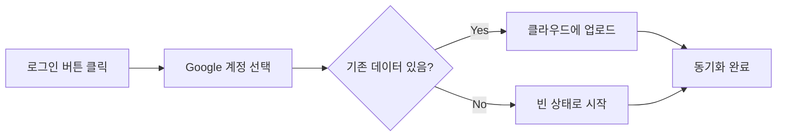
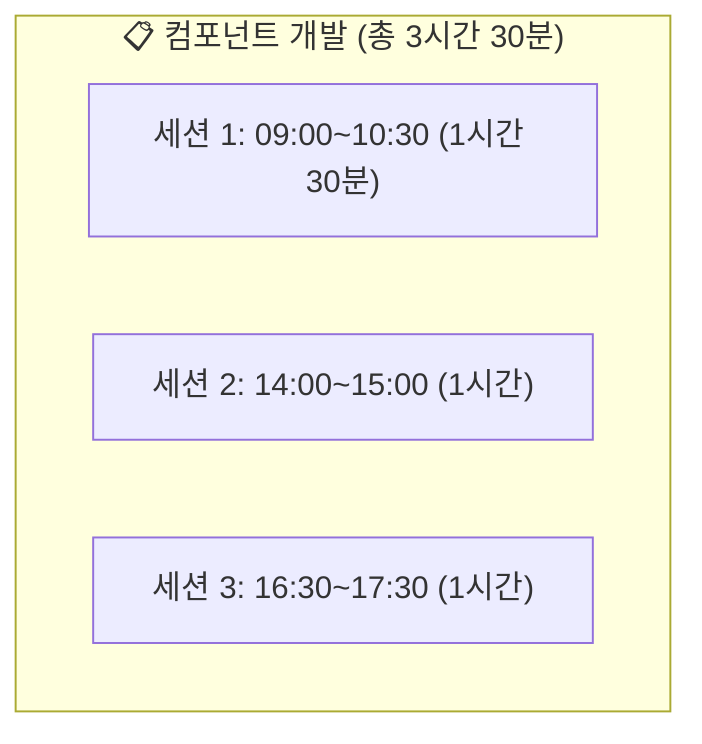

# 시작하기

**업무 시간 관리**는 회사에서 수행하는 작업을 실시간으로 기록하고 관리하는 웹 애플리케이션입니다. 타이머 기반으로 작업 시간을 정확하게 측정하고, 일간/주간 단위로 작업 내역을 체계적으로 관리할 수 있습니다.

---

## 핵심 기능 개요

| 기능 | 설명 | 관련 문서 |
|------|------|-----------|
| **타이머 기반 기록** | 작업 시작/정지로 정확한 시간 측정 | [일간 기록](wiki:daily-record) |
| **작업 프리셋** | 자주 하는 작업을 저장하고 빠르게 시작 | [작업 프리셋](wiki:work-preset) |
| **간트차트 시각화** | 하루 작업을 시간대별로 시각화 | [일간 기록](wiki:daily-record) |
| **주간 리포트** | 주간 작업 내역을 정리하여 복사 | [주간 일정](wiki:weekly-schedule) |
| **클라우드 동기화** | 여러 기기에서 동일한 데이터 사용 | [설정](wiki:settings) |
| **키보드 단축키** | 빠른 조작을 위한 단축키 지원 | [단축키 목록](wiki:shortcuts) |

---

## 로그인 방식

앱은 **게스트 모드**와 **로그인 모드** 두 가지 방식으로 사용할 수 있습니다.

### 게스트 모드 (비로그인)

로그인 없이 바로 사용할 수 있는 모드입니다.

| 항목 | 내용 |
|------|------|
| **장점** | 즉시 사용 가능, 로그인 불필요 |
| **데이터 저장** | 브라우저 LocalStorage |
| **제한사항** | 다른 브라우저/기기에서 접근 불가 |
| **주의** | 브라우저 데이터 삭제 시 데이터 손실 |

> **💡 팁**: 게스트 모드에서도 [설정 > 데이터 내보내기](wiki:settings)로 백업이 가능합니다.

### 로그인 모드 (Google 계정)

우측 상단의 **"로그인"** 버튼을 클릭하여 Google 계정으로 로그인합니다.

| 항목 | 내용 |
|------|------|
| **장점** | 클라우드 저장, 다중 기기 동기화 |
| **데이터 저장** | Firebase Firestore + LocalStorage 백업 |
| **마이그레이션** | 게스트 데이터 자동 업로드 |

### 로그인 과정

### 동기화 상태 표시

헤더 우측에서 현재 동기화 상태를 확인할 수 있습니다:

| 표시 | 상태 | 설명 |
|------|------|------|
| 🔄 동기화 중... | 진행 중 | 데이터를 서버와 동기화하는 중 |
| ☁️ 클라우드 연결됨 | 정상 | 실시간 동기화 중 |
| ✅ 체크 표시 | 저장 완료 | 변경사항이 저장됨 |
| ⚠️ 동기화 오류 | 오류 | 네트워크 문제 발생 |
| 👤 게스트 모드 | 비로그인 | 로컬 저장 모드 |

---

## 화면 구성

### 전체 레이아웃

앱은 **상단 헤더**, **좌측 사이드바**, **메인 콘텐츠** 영역으로 구성됩니다.

| 영역 | 위치 | 주요 기능 |
|------|------|-----------|
| **헤더** | 상단 고정 | 메뉴, 동기화 상태, 설정, 로그인 |
| **사이드바** | 좌측 300px | [작업 프리셋](wiki:work-preset) 목록 |
| **메인 콘텐츠** | 우측 전체 | 간트차트, 작업 테이블 |

### 상단 헤더 구성 요소

| 위치 | 요소 | 기능 |
|------|------|------|
| 좌측 | 🕐 업무 시간 관리 | 앱 로고 |
| 중앙 | 메뉴 탭 | 페이지 이동 |
| 우측 | 동기화 상태 | 클라우드 연결 상태 |
| 우측 | 버전 정보 | 업데이트 내역 확인 |
| 우측 | ⚙️ 설정 | [설정 모달](wiki:settings) 열기 |
| 우측 | 사용자 정보 | 로그인/로그아웃 |

### 일간 기록 페이지

[일간 기록](wiki:daily-record) 페이지는 앱의 메인 화면입니다:

| 영역 | 설명 | 상세 문서 |
|------|------|-----------|
| **좌측 사이드바** | 자주 사용하는 작업 프리셋 목록 | [작업 프리셋](wiki:work-preset) |
| **간트차트 영역** | 선택한 날짜의 작업을 시간대별로 시각화 | [일간 기록](wiki:daily-record) |
| **테이블 영역** | 작업 기록 관리 (추가, 수정, 삭제, 타이머) | [일간 기록](wiki:daily-record) |

---

## 데이터 구조

앱에서 사용하는 주요 데이터 개념입니다.

### 작업 (Work Record)

하나의 **작업**은 특정 업무에 대한 기록입니다.

| 필드 | 설명 | 예시 |
|------|------|------|
| 프로젝트 코드 | 프로젝트 식별 코드 | `A25_01846` |
| 작업명 | 프로젝트/업무 이름 | `프레임워크 FE` |
| 거래명 | 작업의 상세 제목 | `컴포넌트 개발` |
| 업무명 | 업무 유형 | `개발`, `분석`, `설계` |
| 카테고리 | 작업 분류 | `개발`, `회의`, `문서작업` |

### 세션 (Work Session)

하나의 작업에는 여러 개의 **세션**이 있을 수 있습니다. 세션은 타이머를 시작해서 정지할 때까지의 한 구간입니다.

> 같은 작업을 여러 번 나눠서 해도, 각 구간이 세션으로 기록되어 정확한 시간 추적이 가능합니다.

### 프리셋 (Work Template)

**프리셋**은 자주 하는 작업을 미리 저장해둔 템플릿입니다. 자세한 내용은 [작업 프리셋](wiki:work-preset) 문서를 참조하세요.

---

## 모바일 사용

앱은 반응형으로 설계되어 모바일 기기에서도 사용할 수 있습니다.

### 모바일 화면 변화

| 데스크톱 | 모바일 |
|----------|--------|
| 상단 메뉴 탭 | 하단 네비게이션 바 |
| 좌측 프리셋 사이드바 | FAB 버튼 + 드로어 |
| 작업 테이블 | 카드 형태 목록 |

### 모바일 프리셋 접근

1. 화면 우측 하단의 **파란색 FAB 버튼** 터치
2. 하단에서 프리셋 드로어가 올라옴
3. 원하는 프리셋 선택

---

## 다음 단계

앱 사용을 시작하려면 다음 문서들을 참조하세요:

1. **[일간 기록](wiki:daily-record)**: 작업 기록, 타이머, 간트차트 사용법
2. **[작업 프리셋](wiki:work-preset)**: 자주 하는 작업 저장 및 활용
3. **[단축키 목록](wiki:shortcuts)**: 키보드로 빠르게 조작하기
