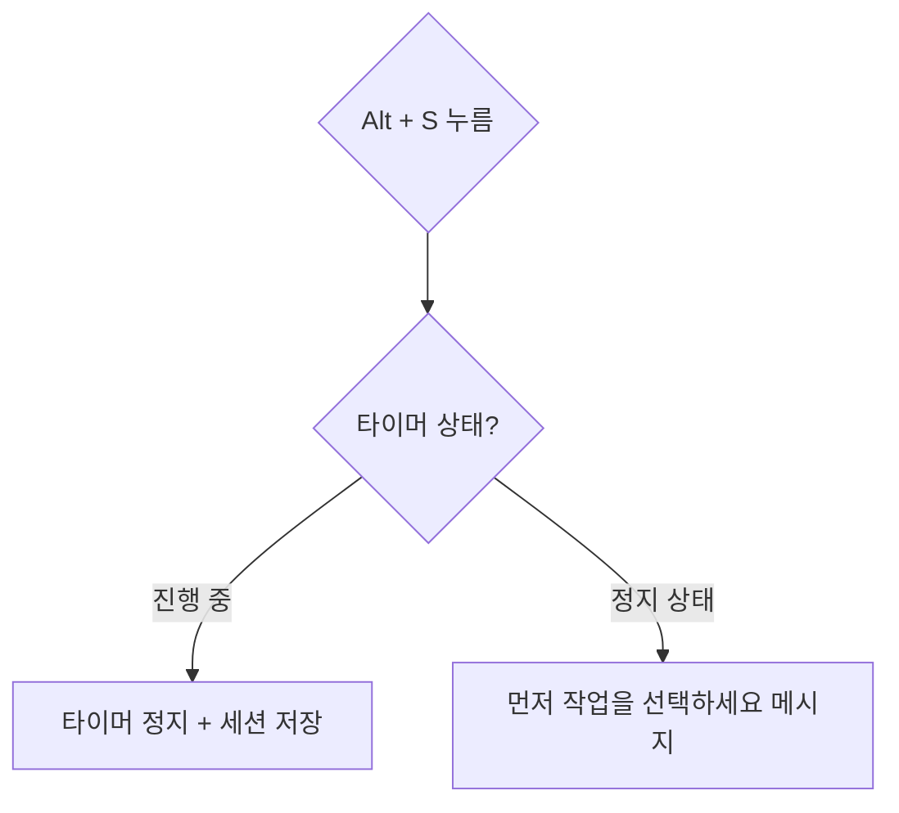
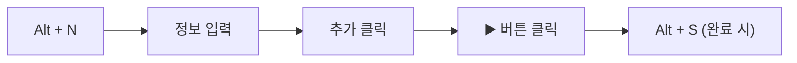

# 단축키 목록

키보드 단축키를 사용하면 마우스 없이도 앱을 빠르게 조작할 수 있습니다. 모든 단축키는 **Alt** 키를 기반으로 합니다.

---

## 단축키 사용 조건

### 작동하는 경우

- 페이지에 포커스가 있을 때
- 입력 필드가 아닌 곳에서

### 작동하지 않는 경우

- Input, Select, TextArea 등 **입력 필드에 포커스**가 있을 때
- 모달 내부의 입력 필드에서 타이핑 중일 때

> 입력 필드에서 단축키가 작동하지 않는 것은 일반 타이핑과의 충돌을 방지하기 위함입니다.

---

## 단축키 전체 목록

아래는 모든 단축키 목록입니다:

:::demo ShortcutsTable:::

---

## 일반 단축키

자주 사용하는 기본 동작입니다.

| 단축키 | 기능 | 설명 |
|--------|------|------|
| `Alt + N` | 새 작업 추가 | [작업 추가 모달](wiki:daily-record) 열기 |
| `Alt + P` | 새 프리셋 추가 | [프리셋 추가 모달](wiki:work-preset) 열기 |
| `Alt + ,` | 설정 열기 | [설정 모달](wiki:settings) 열기 |
| `Alt + /` | 단축키 도움말 | 설정의 단축키 탭 열기 |

---

## 타이머 단축키

타이머 조작을 위한 단축키입니다.

| 단축키 | 기능 | 설명 |
|--------|------|------|
| `Alt + S` | 타이머 시작/중지 | 현재 작업의 타이머 토글 |
| `Alt + R` | 타이머 초기화 | 진행 중인 타이머 리셋 |

### 타이머 단축키 동작

> **팁**: 타이머를 시작하려면 먼저 [프리셋](wiki:work-preset)을 클릭하거나 테이블의 ▶️ 버튼을 사용하세요.

---

## 네비게이션 단축키

페이지 및 날짜 이동을 위한 단축키입니다.

| 단축키 | 기능 | 설명 |
|--------|------|------|
| `Alt + T` | 오늘로 이동 | 오늘 날짜로 이동 |
| `Alt + ←` | 이전 날짜 | 하루 전으로 이동 |
| `Alt + →` | 다음 날짜 | 하루 후로 이동 |
| `Alt + 1` | 일간 기록 | [일간 기록](wiki:daily-record) 페이지로 이동 |
| `Alt + 2` | 주간 일정 | [주간 일정](wiki:weekly-schedule) 페이지로 이동 |

---

## 데이터 단축키

데이터 관리를 위한 단축키입니다.

| 단축키 | 기능 | 설명 |
|--------|------|------|
| `Alt + E` | 데이터 내보내기 | JSON 파일로 내보내기 |
| `Alt + Shift + S` | 수동 동기화 | 클라우드와 동기화 (로그인 시) |

---

## 단축키 설정

### 활성화/비활성화

[설정](wiki:settings)에서 개별 단축키를 활성화/비활성화할 수 있습니다.

### 기본값 복원

모든 단축키를 기본 상태로 복원하려면:

1. 설정 > 단축키 탭
2. **"기본값으로 초기화"** 버튼 클릭

---

## 단축키 충돌

### 브라우저 단축키와의 충돌

일부 `Alt` 조합은 브라우저 자체 단축키와 충돌할 수 있습니다:

| 단축키 | 잠재적 충돌 |
|--------|-------------|
| `Alt + ←` | 브라우저 뒤로 가기 (일부 브라우저) |
| `Alt + →` | 브라우저 앞으로 가기 (일부 브라우저) |

충돌이 발생하면 [설정](wiki:settings)에서 해당 단축키를 비활성화하세요.

---

## 자주 사용하는 작업 흐름

### 빠른 작업 기록

### 날짜 간 빠른 탐색

| 동작 | 단축키 |
|------|--------|
| 어제 기록 확인 | `Alt + ←` |
| 내일로 이동 | `Alt + →` |
| 오늘로 복귀 | `Alt + T` |

### 페이지 간 이동

| 동작 | 단축키 |
|------|--------|
| 일간 기록 (작업 등록) | `Alt + 1` |
| 주간 일정 (보고서 복사) | `Alt + 2` |

---

## 관련 문서

- **[시작하기](wiki:getting-started)**: 앱 전체 개요
- **[일간 기록](wiki:daily-record)**: 작업 기록 및 타이머 상세
- **[작업 프리셋](wiki:work-preset)**: 프리셋 관리
- **[설정](wiki:settings)**: 단축키 설정 방법
