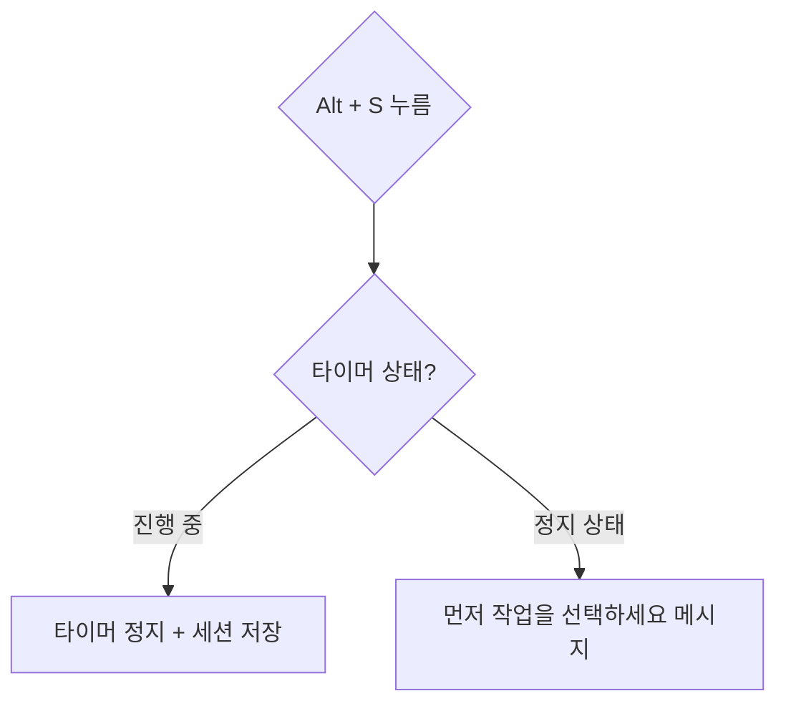
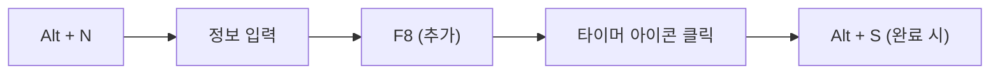

# 단축키 목록

키보드 단축키를 사용하면 마우스 없이도 앱을 빠르게 조작할 수 있어요. 모든 단축키는 [설정](wiki:settings)에서 활성화/비활성화하거나 키 조합을 변경할 수 있어요.

---

## 단축키 사용 조건

### 입력란에 커서가 있을 때

| 단축키 유형                       | 동작 여부  |
| --------------------------------- | ---------- |
| `Alt` 조합 (`Alt+N`, `Alt+←` 등)  | 작동해요   |
| `F8` (모달 저장)                  | 작동해요   |
| `Enter`, `ESC` (확인창)           | 작동해요   |

`Alt` 조합은 글자 입력과 겹치지 않아서 타이핑 중에도 그대로 쓸 수 있어요.

### 모달이나 확인창이 열려 있을 때

모달이 열리면 **전역 단축키는 모두 멈춰요.** 모달 위에서 `Alt+N`을 눌러 또 다른 모달이 뜨거나, 뒤에서 날짜가 바뀌는 일이 없어요.

| 상황                | 동작하는 키                 |
| ------------------- | --------------------------- |
| 모달이 열려 있을 때 | `F8` (저장), `ESC` (닫기)   |
| 확인창이 떠 있을 때 | `Enter` (확인), `ESC` (취소) |

모달을 닫으면 전역 단축키가 다시 살아나요. 모달이 여러 겹 열려 있으면 **맨 위 모달의 단축키만** 동작해요.

### 포커스

-   모달이 열리면 첫 입력란으로 커서가 자동으로 옮겨가요
-   모달을 닫으면 열기 전에 있던 자리로 커서가 되돌아가요
-   삭제 확인창이 뜨면 확인 버튼에 커서가 놓여서 `Enter`로 바로 실행돼요

---

## 단축키 전체 목록

아래는 모든 단축키 목록이에요:

:::demo ShortcutsTable:::

---

## 일반 단축키

자주 사용하는 기본 동작이에요.

| 단축키    | 기능           | 설명                                                    |
| --------- | -------------- | ------------------------------------------------------- |
| `Alt + N` | 새 작업 추가   | [작업 추가 모달](wiki:daily-record) 열기                |
| `Alt + P` | 새 프리셋 추가 | [프리셋 추가 모달](wiki:work-preset) 열기               |
| `Alt + ,` | 설정 열기      | [설정 모달](wiki:settings) 열기                         |
| `Alt + /` | 단축키 도움말  | 설정의 단축키 탭 열기                                   |
| `F8`      | 모달 저장/추가 | 작업 추가, 수정, 프리셋 추가 등 모달에서 저장/추가 실행 |

> **참고**: `F8`은 모달이 열려 있을 때만 동작하고, 입력란에 커서가 있어도 작동해요.

---

## 타이머 단축키

타이머 조작을 위한 단축키에요.

| 단축키    | 기능             | 설명                                 |
| --------- | ---------------- | ------------------------------------ |
| `Alt + S` | 타이머 시작/중지 | 현재 작업의 타이머를 시작하거나 중지 |
| `Alt + R` | 타이머 초기화    | 타이머를 초기화                      |

### 타이머 단축키 동작

```mermaid
flowchart TB
    A{"Alt + S 누름"} --> B{타이머 상태?}
    B -->|진행 중| C[타이머 정지 + 세션 저장]
    B -->|정지 상태| D[먼저 작업을 선택하세요 메시지]
```

> **팁**: 타이머를 시작하려면 먼저 [프리셋](wiki:work-preset)의 + 버튼을 클릭하거나 테이블의 타이머 아이콘을 사용하세요.

---

## 네비게이션 단축키

페이지 및 날짜 이동을 위한 단축키에요.

| 단축키    | 기능        | 설명                                            |
| --------- | ----------- | ----------------------------------------------- |
| `Alt + T` | 오늘로 이동 | 오늘 날짜로 이동                                |
| `Alt + ←` | 이전 날짜   | 하루 전으로 이동                                |
| `Alt + →` | 다음 날짜   | 하루 후로 이동                                  |
| `Alt + 1` | 일간 기록   | [일간 기록](wiki:daily-record) 페이지로 이동    |
| `Alt + 2` | 주간 일정   | [주간 일정](wiki:weekly-schedule) 페이지로 이동 |

---

## 데이터 단축키

데이터 관리를 위한 단축키에요.

| 단축키            | 기능            | 설명                                   |
| ----------------- | --------------- | -------------------------------------- |
| `Alt + E`         | 데이터 내보내기 | JSON 파일로 내보내기                   |
| `Alt + Shift + S` | 수동 동기화     | 클라우드와 수동으로 동기화 (로그인 시) |

---

## 단축키 설정

### 활성화/비활성화

[설정](wiki:settings)의 단축키 탭에서 각 단축키의 **Switch를 토글**하여 개별적으로 활성화/비활성화할 수 있어요.

> **활용**: 브라우저나 다른 앱의 단축키와 충돌하는 경우 비활성화하세요.

### 키 조합 변경

단축키의 키 조합을 원하는 대로 변경할 수 있어요:

1. 설정 > 단축키 탭
2. 변경하고 싶은 단축키 클릭
3. 키 편집 모달에서 **"여기를 클릭하고 단축키를 누르세요"**
4. 새 키 조합 입력 (예: `Ctrl+K`, `Alt+M` 등)
5. **"저장"** 클릭

> **제약 사항**:
>
> -   수정자 키(Ctrl/Alt/Shift) 중 하나 이상 필요 (F1~F12 제외)
> -   다른 단축키와 중복 불가
> -   ESC로 취소

### 기본값 복원

모든 단축키를 기본 상태로 복원하려면:

1. 설정 > 단축키 탭
2. **"기본값으로 초기화"** 버튼 클릭

---

## 단축키 충돌

### 브라우저 단축키와의 충돌

일부 `Alt` 조합은 브라우저 자체 단축키와 충돌할 수 있어요:

| 단축키    | 잠재적 충돌                          |
| --------- | ------------------------------------ |
| `Alt + ←` | 브라우저 뒤로 가기 (일부 브라우저)   |
| `Alt + →` | 브라우저 앞으로 가기 (일부 브라우저) |

충돌이 발생하면 [설정](wiki:settings)에서 해당 단축키를 비활성화하거나 다른 키 조합으로 변경하세요.

---

## 자주 사용하는 작업 흐름

### 빠른 작업 기록

```mermaid
flowchart LR
    A["Alt + N"] --> B[정보 입력]
    B --> C["F8 (추가)"]
    C --> D["타이머 아이콘 클릭"]
    D --> E["Alt + S (완료 시)"]
```

### 날짜 간 빠른 탐색

| 동작           | 단축키    |
| -------------- | --------- |
| 어제 기록 확인 | `Alt + ←` |
| 내일로 이동    | `Alt + →` |
| 오늘로 복귀    | `Alt + T` |

### 페이지 간 이동

| 동작                    | 단축키    |
| ----------------------- | --------- |
| 일간 기록 (작업 등록)   | `Alt + 1` |
| 주간 일정 (보고서 복사) | `Alt + 2` |

---

## 관련 문서

-   **[시작하기](wiki:getting-started)**: 앱 전체 개요
-   **[일간 기록](wiki:daily-record)**: 작업 기록 및 타이머 상세
-   **[작업 프리셋](wiki:work-preset)**: 프리셋 관리
-   **[설정](wiki:settings)**: 단축키 설정 방법
