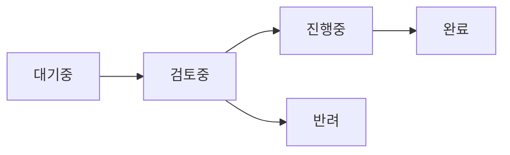
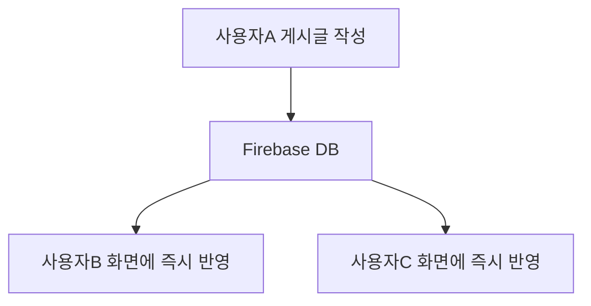

# 건의사항 게시판

**건의사항 게시판**에서는 앱 개선 아이디어나 버그 리포트를 작성하고, 다른 사용자들과 의견을 나눌 수 있어요. 모든 건의사항은 실시간으로 동기화돼요.

> **참고**: 건의사항 기능은 상황에 따라 비활성화될 수 있어요. 메뉴에 보이지 않으면 일시적으로 숨겨진 상태예요.

---

## 페이지 접근

-   **데스크톱**: 상단 메뉴에서 **"건의사항"** 클릭
-   **모바일**: 하단 네비게이션의 **"건의"** 탭 터치

---

## 게시글 상태

각 게시글에는 처리 상태가 표시돼요:

| 상태       | 색상   | 설명               |
| ---------- | ------ | ------------------ |
| **대기중** | 회색   | 아직 검토되지 않음 |
| **검토중** | 파란색 | 개발자가 검토 중   |
| **진행중** | 주황색 | 개발/수정 작업 중  |
| **완료**   | 녹색   | 처리 완료됨        |
| **반려**   | 빨간색 | 반영 불가          |

### 상태 흐름

---

## 페이지 구성

게시판은 카드 레이아웃으로 구성돼요.

| 요소            | 설명                                           |
| --------------- | ---------------------------------------------- |
| **카드 헤더**   | 메시지 아이콘 + "건의사항" 타이틀              |
| **글쓰기 버튼** | 편집 아이콘 + "글쓰기" (모바일에서는 아이콘만) |
| **게시글 목록** | 접기/펼치기 가능한 게시글 리스트               |

### 게시글 목록

게시글은 **최신순**으로 정렬되어 표시돼요. 각 게시글 헤더에는 다음 정보가 있어요:

| 요소          | 설명                                                 |
| ------------- | ---------------------------------------------------- |
| **제목**      | 게시글 제목                                          |
| **상태 태그** | 처리 상태 (대기중, 검토중 등)                        |
| **해결 버전** | 완료된 경우 해결된 버전 표시 (예: `v1.0.5에서 해결`) |
| **작성자**    | 닉네임                                               |
| **작성시간**  | 상대 시간 (예: "3시간 전")                           |
| **답글 수**   | 달린 답글 개수                                       |

### 빈 상태

게시글이 없으면 다음 메시지가 표시돼요:

-   **"아직 건의사항이 없습니다"**
-   "첫 건의사항 작성하기" 버튼

---

## 게시글 작성

### 작성 방법

1. **"글쓰기"** 버튼 클릭
2. 모달에서 내용 입력
3. **"등록"** 버튼 클릭

### 입력 필드

| 필드       | 설명             | 필수 |
| ---------- | ---------------- | :--: |
| **닉네임** | 작성자 표시 이름 |  O   |
| **제목**   | 게시글 제목      |  O   |
| **내용**   | 상세 설명        |  O   |

### 좋은 건의사항 작성 팁

| 항목          | 권장 사항                     |
| ------------- | ----------------------------- |
| **제목**      | 핵심 내용을 간결하게 요약     |
| **현재 문제** | 현재 불편한 점 설명           |
| **개선 방향** | 원하는 개선 방향 제시         |
| **재현 방법** | 버그인 경우 재현 단계 기술    |
| **환경 정보** | 브라우저, 기기 정보 (버그 시) |

---

## 답글 작성

게시글을 펼치면 하단에 답글 입력 폼이 있어요:

1. **닉네임** 입력
2. **답글 내용** 입력
3. **"답글 달기"** 버튼 클릭

> 답글은 실시간으로 다른 사용자에게도 표시돼요.

---

## 내 게시글 관리

### 작성자 식별 방식

| 로그인 상태 | 식별 방식           |
| ----------- | ------------------- |
| **로그인**  | Firebase UID로 식별 |
| **게스트**  | 브라우저별 고유 ID  |

### 수정/삭제

본인이 작성한 게시글에는 **수정** / **삭제** 버튼이 표시돼요.

> **주의**: 삭제된 게시글은 복구할 수 없어요.

---

## 실시간 업데이트

건의사항 게시판은 **Firebase 실시간 동기화**를 사용해요:

| 동기화 항목   | 설명                    |
| ------------- | ----------------------- |
| **새 게시글** | 즉시 목록에 추가        |
| **새 답글**   | 즉시 답글 목록에 추가   |
| **상태 변경** | 즉시 상태 태그 업데이트 |
| **수정/삭제** | 즉시 반영               |

---

## 활용 팁

### 효과적인 피드백

| DO                      | DON'T            |
| ----------------------- | ---------------- |
| 구체적인 상황 설명      | 막연한 불만 표현 |
| 재현 가능한 버그 리포트 | "안 돼요"만 작성 |
| 개선 방향 제시          | 문제만 나열      |

### 기존 건의사항 확인

새 건의사항을 작성하기 전에 **기존 게시글을 확인**하세요. 이미 같은 내용이 있으면 답글로 의견을 추가하는 것이 좋아요.

---

## 관련 문서

-   **[시작하기](wiki:getting-started)**: 앱 전체 개요
-   **[설정](wiki:settings)**: 앱 설정 및 데이터 관리
