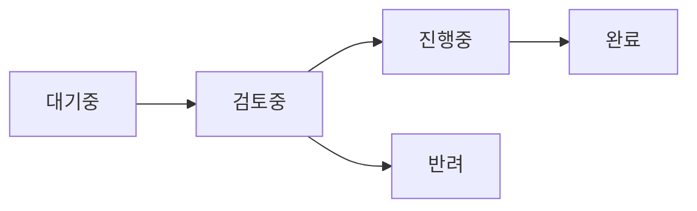
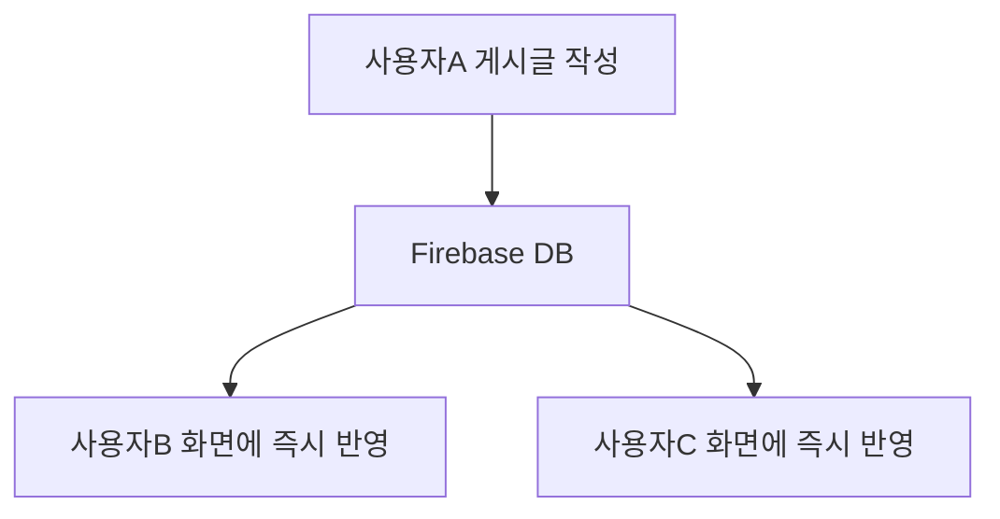

# 건의사항 게시판

**건의사항 게시판**에서는 앱 개선 아이디어나 버그 리포트를 작성하고, 다른 사용자들과 의견을 나눌 수 있습니다. 모든 건의사항은 실시간으로 동기화됩니다.

---

## 페이지 접근

상단 메뉴에서 **"건의사항"** 클릭

---

## 게시글 상태

각 게시글에는 처리 상태가 표시됩니다:

| 상태       | 색상   | 설명               |
| ---------- | ------ | ------------------ |
| **대기중** | 회색   | 아직 검토되지 않음 |
| **검토중** | 파란색 | 개발자가 검토 중   |
| **진행중** | 주황색 | 개발/수정 작업 중  |
| **완료**   | 녹색   | 처리 완료됨        |
| **반려**   | 빨간색 | 반영 불가          |

### 상태 흐름

---

## 게시글 목록

게시글은 **최신순**으로 정렬되어 표시됩니다.

| 요소          | 설명                       |
| ------------- | -------------------------- |
| **▶ / ▼**     | 게시글 펼침/접힘           |
| **[상태]**    | 처리 상태 태그             |
| **제목**      | 게시글 제목                |
| **작성자**    | 닉네임                     |
| **작성시간**  | 상대 시간 (예: "3시간 전") |
| **💬 답글수** | 달린 답글 개수             |

### 완료된 건의사항

완료된 건의사항에는 **해결 버전**이 표시됩니다.

예: `✅ v1.0.5에서 해결됨`

---

## 게시글 작성

### 작성 방법

1. **"✏️ 건의하기"** 버튼 클릭
2. 모달에서 내용 입력
3. **"등록"** 버튼 클릭

### 입력 필드

| 필드            | 설명                    | 필수 |
| --------------- | ----------------------- | :--: |
| **닉네임**      | 작성자 표시 이름        |  ✅  |
| **제목**        | 게시글 제목             |  ✅  |
| **내용**        | 상세 설명               |  ✅  |
| **이미지 첨부** | 스크린샷 등 이미지 첨부 |  ❌  |

### 이미지 첨부

버그 리포트나 UI 개선 요청 시 스크린샷을 첨부할 수 있습니다.

| 항목          | 제한                   |
| ------------- | ---------------------- |
| **최대 개수** | 5개                    |
| **파일 크기** | 각 5MB 이하            |
| **지원 형식** | JPG, PNG, GIF, WebP 등 |

**첨부 방법:**

1. 게시글 작성/수정 모달에서 **"이미지 추가"** 버튼 클릭
2. 이미지 파일 선택
3. 업로드된 이미지는 게시글 본문에 표시됨

**기존 게시글에 이미지 추가:**

-   본인이 작성한 게시글에서 **"이미지 첨부"** 버튼으로 추가 가능
-   이미지 우측 상단의 **삭제 버튼**으로 개별 삭제 가능

### 좋은 건의사항 작성 팁

| 항목          | 권장 사항                     |
| ------------- | ----------------------------- |
| **제목**      | 핵심 내용을 간결하게 요약     |
| **현재 문제** | 현재 불편한 점 설명           |
| **개선 방향** | 원하는 개선 방향 제시         |
| **재현 방법** | 버그인 경우 재현 단계 기술    |
| **환경 정보** | 브라우저, 기기 정보 (버그 시) |

---

## 답글 작성

게시글 하단의 답글 입력 폼에서 답글을 작성합니다:

1. **닉네임** 입력
2. **답글 내용** 입력
3. **"답글 달기"** 버튼 클릭

> 답글은 실시간으로 다른 사용자에게도 표시됩니다.

---

## 내 게시글 관리

### 작성자 식별 방식

| 로그인 상태 | 식별 방식           |
| ----------- | ------------------- |
| **로그인**  | Firebase UID로 식별 |
| **게스트**  | 브라우저별 고유 ID  |

### 수정/삭제

본인이 작성한 게시글에는 **✏️ 수정** / **🗑️ 삭제** 버튼이 표시됩니다.

> **주의**: 삭제된 게시글은 복구할 수 없습니다.

---

## 실시간 업데이트

건의사항 게시판은 **Firebase 실시간 동기화**를 사용합니다:

| 동기화 항목   | 설명                    |
| ------------- | ----------------------- |
| **새 게시글** | 즉시 목록에 추가        |
| **새 답글**   | 즉시 답글 목록에 추가   |
| **상태 변경** | 즉시 상태 태그 업데이트 |
| **수정/삭제** | 즉시 반영               |

---

## 활용 팁

### 효과적인 피드백

| DO ✅                   | DON'T ❌         |
| ----------------------- | ---------------- |
| 구체적인 상황 설명      | 막연한 불만 표현 |
| 재현 가능한 버그 리포트 | "안 돼요"만 작성 |
| 개선 방향 제시          | 문제만 나열      |

### 기존 건의사항 확인

새 건의사항을 작성하기 전에 **기존 게시글을 확인**하세요. 이미 같은 내용이 있으면 답글로 의견을 추가하는 것이 좋습니다.

---

## 관련 문서

-   **[시작하기](wiki:getting-started)**: 앱 전체 개요
-   **[설정](wiki:settings)**: 앱 설정 및 데이터 관리
