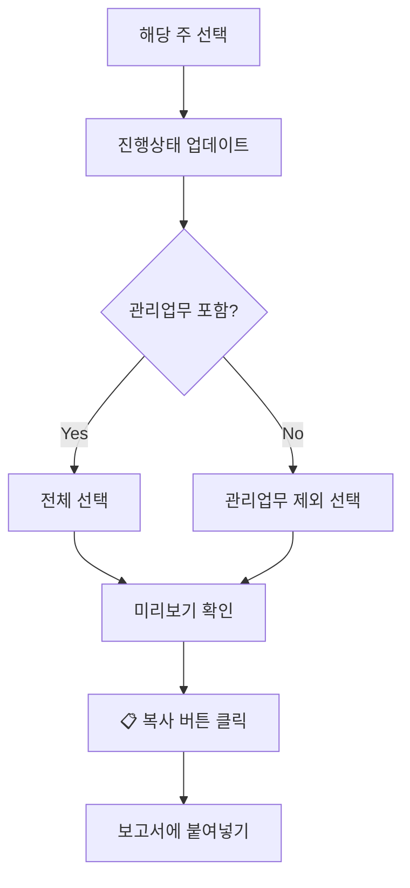

# 주간 일정

**주간 일정** 페이지에서는 한 주 동안의 작업을 정리하고, 보고서 형식으로 복사할 수 있습니다. 주간 회의나 업무 보고 시 유용합니다.

---

## 페이지 접근

- 상단 메뉴에서 **"주간 일정"** 클릭
- [단축키](wiki:shortcuts): `Alt + 2`

---

## 주간 선택

### 주 선택기

| 요소 | 기능 |
|------|------|
| **◀** | 이전 주로 이동 |
| **▶** | 다음 주로 이동 |
| **📅 날짜** | 달력에서 특정 주 선택 |
| **이번 주** | 현재 주로 바로 이동 |

### 주 표시 형식

예시: `2026년 1월 3주차 (1/13 월 ~ 1/19 일)`

> 주의 시작은 **월요일**입니다 (ISO 주 기준).

---

## 작업 목록 표시

### 날짜별 그룹화

주간 작업은 **날짜별**로 그룹화되어 표시됩니다. 해당 날짜에 세션이 있는 작업만 표시됩니다.

### 표시 정보

| 항목 | 설명 | 계산 방식 |
|------|------|-----------|
| **프로젝트 코드** | `[A25_01846]` 형식 | 작업의 프로젝트 코드 |
| **작업명** | 프로젝트/업무명 | 작업의 작업명 |
| **진행상태** | 진행중/완료 등 | 수정 가능 |
| **시작일자** | 해당 작업의 최초 기록일 | 전체 기록에서 계산 |
| **누적시간** | 전체 기간 누적 소요 시간 | 전체 기록에서 계산 |
| **거래 목록** | 하위 작업들 | 각 거래의 누적시간 포함 |

### 누적시간 계산

**누적시간**은 해당 **날짜까지의 누적 시간**입니다. 각 날짜별로 해당 날짜까지 수행한 시간의 합계가 표시됩니다.

예를 들어 같은 작업이 여러 날에 걸쳐 표시되는 경우:
- 1/19(월): 2시간 작업 → 누적시간: 02:00
- 1/20(화): 2시간 추가 작업 → 누적시간: 04:00
- 1/21(수): 2시간 추가 작업 → 누적시간: 06:00

---

## 진행상태 수정

각 작업의 **"진행상태"** 입력 필드를 직접 클릭하여 수정할 수 있습니다.

### 기본값

| 작업 상태 | 기본 진행상태 |
|-----------|---------------|
| 완료된 작업 | "완료" |
| 진행 중인 작업 | "진행중" |

### 활용 예시

- `진행중 (30%)`
- `진행중 (코드리뷰 대기)`
- `완료`
- `QA 진행중`
- `배포 완료`

---

## 관리업무 필터

### 필터 옵션

| 옵션 | 설명 |
|------|------|
| **전체** | 모든 작업 표시 |
| **관리업무 제외** | `[A24_05591] 관리업무` 숨김 |

> **활용**: 프로젝트 작업만 보고하고 싶을 때 "관리업무 제외"를 선택하세요.

---

## 복사 기능

### 복사하기

**"📋 복사"** 버튼을 클릭하면 주간 작업 내역이 클립보드에 복사됩니다.

### 복사 형식 선택

복사 미리보기 영역에서 **형식 1** 또는 **형식 2**를 선택할 수 있습니다.

| 형식 | 설명 |
|------|------|
| **형식 1** | 기존 형식 (간결한 텍스트) |
| **형식 2** | 구분선 형식 (날짜별 구분선, 시각적 강조) |

### 형식 1 예시 (기존 형식)

```
1/14 (화)
[A25_01846] 프레임워크 FE (진행상태: 진행중, 시작일자: 1/10(금), 누적시간: 08:30)
> 컴포넌트 개발 (누적시간: 02:30)
> API 연동 (누적시간: 01:00)
[A00_00000] 문서작업 (진행상태: 완료, 시작일자: 1/14(화), 누적시간: 01:30)
> 설계서 작성 (누적시간: 01:30)
```

### 형식 2 예시 (구분선 형식)

```
────────────────────────────────────────
■ 1/14 (화)
────────────────────────────────────────
[A25_01846] 프레임워크 FE (진행상태: 진행중, 시작일자: 1/10(금), 누적시간: 08:30)
  · 컴포넌트 개발 (누적시간: 02:30)
  · API 연동 (누적시간: 01:00)

[A00_00000] 문서작업 (진행상태: 완료, 시작일자: 1/14(화), 누적시간: 01:30)
  · 설계서 작성 (누적시간: 01:30)
```

### 복사 미리보기

페이지 하단에 복사될 내용이 미리보기로 표시됩니다. 형식 선택 버튼으로 원하는 형식을 미리 확인할 수 있습니다.

---

## 주간 보고서 작성 흐름



---

## 일간 기록과의 차이

| 항목 | [일간 기록](wiki:daily-record) | 주간 일정 |
|------|--------------------------------|-----------|
| **범위** | 하루 | 한 주 (월~일) |
| **그룹화** | 작업별 | 날짜 > 작업 > 거래 |
| **시간 표시** | 당일 시간 | 전체 누적 시간 |
| **수정 기능** | 작업 추가/수정/삭제 | 진행상태만 수정 |
| **복사 형식** | 간단한 형식 | 상세 보고서 형식 |

---

## 관련 문서

- **[시작하기](wiki:getting-started)**: 앱 전체 개요
- **[일간 기록](wiki:daily-record)**: 일별 상세 작업 관리
- **[단축키 목록](wiki:shortcuts)**: 페이지 이동 단축키 (`Alt + 2`)
